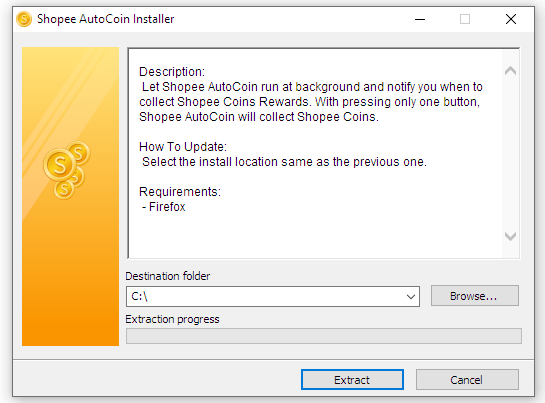
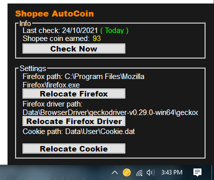
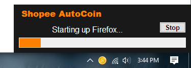

# This Repo is No Longer Maintained
This repository is no longer actively maintained. The method used is no longer effective due to increased website security measures by Shopee. Besides, time constraints prevent me from maintaining this repository.

Thank you to everyone who has used this software. This repo will be archive soon.

 

# Shopee AutoCoin
Let Shopee AutoCoin run at background and notify you when to collect **Shopee Coins Rewards**. With pressing only **one button**, Shopee AutoCoin will collect Shopee Coins Rewards **automatically** for you.
## How To Install
1. Download the installer [**here**](https://github.com/Zigatronz/Shopee-AutoCoin/releases)
2. Run **ShopeeAutoCoin_Installer.exe** from your download folder.
3. Browse location to install and click **Extract**.

4. Run **Shopee AutoCoin.exe** at the extracted location.
5. As you click **Check Now**, you're ready to go.

## How To Update
1. Download the latest version [**here**](https://github.com/Zigatronz/Shopee-AutoCoin/releases)
2. Select the install location **same as the previous one**.
## How To Uninstall
1. Just delete Shopee-AutoCoin folder
## Set Startup Program
1. After the installation, **right click** on **Shopee AutoCoin.exe** and select **Copy**
2. By using **windows explorer**, navigate to **"C:\\Users\\*YourUserName*\\AppData\\Roaming\\Microsoft\\Windows\\Start Menu\\Programs\\Startup"**
3. **Right click** on it and select **Paste shortcut**
## Requirements
- [**Firefox**](https://www.mozilla.org/)
- [**Gecko Driver**](https://github.com/mozilla/geckodriver/releases) is already in the installer
## Permissions
- Storage: only on working directory.
- Firefox: Run at background during coin collection.
- Internet: https://shopee.com and https://github.com

